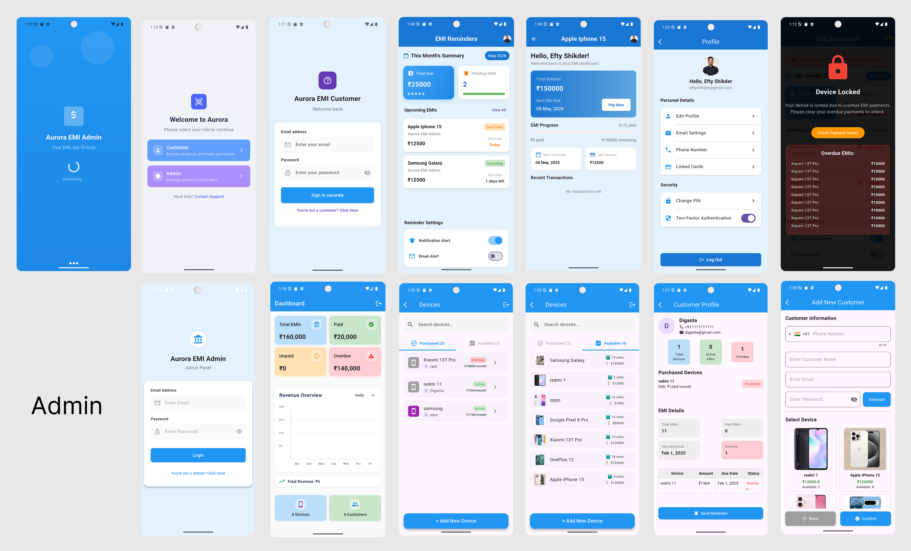

<div align="center">

# 🌌 Aurora EMI Manager

**A modern dual-role EMI management system built with Flutter & Firebase**

[](https://flutter.dev)
[](https://firebase.google.com)
[](https://pub.dev/packages/get)
[](https://flutter.dev)

</div>

---

<div align="center">
  
  <br/>
  <sub><i>Splash · Role Selection · Customer Login · EMI Dashboard · Profile · Lock Screen · Admin Login · Analytics · Device Management · Customer Profile · Add Customer</i></sub>
</div>

---

## 🧩 About

**Aurora EMI Manager** is a mobile-first installment payment management system designed for businesses that sell devices on EMI (Equated Monthly Installments). It supports two distinct user roles — **Customers** and **Administrators** — each with their own tailored experience.

Customers can track their loan schedules, monitor due amounts, and receive payment reminders. Administrators get full visibility into device inventory, EMI revenue performance, and overdue loan status — all from a clean, reactive Flutter UI backed by Firebase Firestore.

---

## ✨ Features

### 👤 Customer Side
- 🔐 Secure login via Firestore-backed credential validation
- 📅 View full EMI schedule with monthly breakdown
- 💰 See total due, pending EMIs, and upcoming payments
- 🔴 Overdue status badges for missed payments
- 🔒 **Smart lock screen** — blocks app access when overdue EMIs exist, forcing resolution before resuming normal use
- 🔔 Notification and email alert preferences
- 🔄 Pull-to-refresh for real-time data sync
- 🧾 Detailed EMI history per loan

### 🛠️ Admin Side
- 📊 Business analytics dashboard with key metrics:
    - Total EMI collected
    - Paid vs. Unpaid breakdown
    - Overdue amount tracking
- 📈 Interactive revenue charts (via `fl_chart`) with time-range filters: Daily / Weekly / Monthly / Yearly
- 📱 Device inventory management — add new devices with live name-uniqueness validation
- 👥 Customer management and loan overview
- 🔑 Dedicated admin credentials stored securely in Firestore

---

## 🏗️ Architecture

```
main.dart
│
├── SplashScreen        ← Reads local session, validates against Firestore
│
├── RoleSelectionPage   ← Entry point for new users
│   ├── CustomerLoginScreen
│   └── AdminLoginPage
│
├── Customer Flow
│   ├── EMIReminderScreen    ← Main customer dashboard
│   ├── EMIController        ← GetX controller: fetches & computes loan data
│   ├── LoanModel            ← EMI math, due date logic, overdue detection
│   └── DevicePolicyController ← Manages overdue lock overlay
│
└── Admin Flow
    ├── DashboardPage        ← Business analytics + charts
    ├── DevicesPage          ← Inventory browser
    ├── CustomersScreen      ← Customer overview
    ├── AuthController       ← Form validation & login flow
    └── AddDeviceController  ← New device creation with Firestore sync
```

**State Management:** GetX (`.obs` fields + `Obx()` widgets)  
**Backend:** Firebase Firestore (real-time listeners)  
**Session:** SharedPreferences (login persistence across restarts)  
**Navigation:** GetX named routes

---

## 🚀 Getting Started

### Prerequisites

- Flutter SDK `>=3.41.6`
- Firebase project with **Firestore** and **Authentication** enabled
- Android Studio / VS Code with Flutter extension

## 🗄️ Firestore Data Model

### `admin/credentials`
```json
{
  "email": "admin@yourname.com",
  "password": "yourpassword"
}
```

### `customers/{customerId}`
```json
{
  "email": "customer@example.com",
  "password": "customerpassword",
  "name": "John Doe",
  "phone": "+8801XXXXXXXXX"
}
```

### `loans/{loanId}`
```json
{
  "customer_id": "customer@example.com",
  "device_name": "Samsung Galaxy A54",
  "total_amount": 45000,
  "total_month": 12,
  "purchase_date": "2024-01-15",
  "transaction_history": [
    { "month": 1, "paid": true, "paid_date": "2024-02-15" },
    { "month": 2, "paid": false }
  ]
}
```

### `devices/{deviceId}`
```json
{
  "model_name": "iPhone 15",
  "price": 120000,
  "total_units": 10,
  "image_url": "https://..."
}
```

---

## 📦 Key Packages

| Package | Purpose |
|---|---|
| `get` | Navigation, state management, snackbars |
| `firebase_core` | Firebase initialization |
| `cloud_firestore` | Real-time database & queries |
| `shared_preferences` | Local session persistence |
| `fl_chart` | Admin analytics charts |
| `device_policy_controller` | Overdue lock-screen enforcement |
| `intl` | Date formatting & localization |
| `intl_phone_field` | Phone number input with country codes |
| `random_string` | Unique ID generation |

---

## 📄 License

This project is licensed under the MIT License.

---